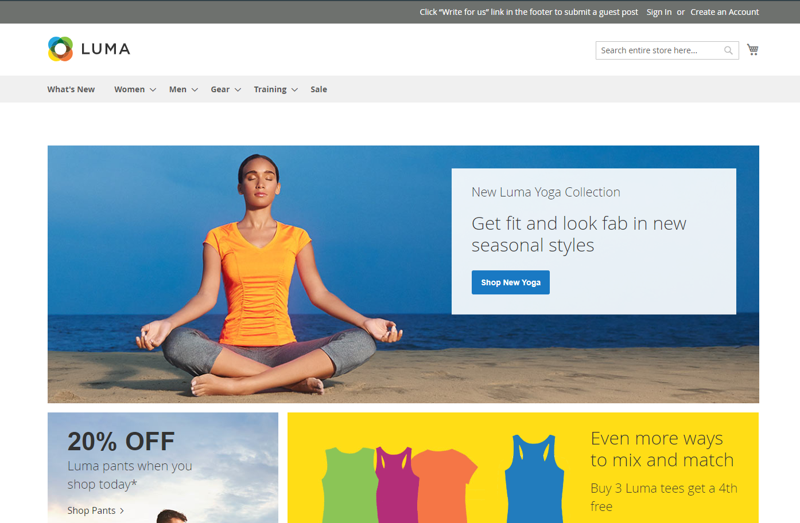

<h1 align="center">Luma e-Commerce Store Test</h1>  

  The Luma (Magneto) online store demo site is designed to try Web UI element tests. Here I have tested Account creation, login, Search products, Filter products, Add to cart, and Payouts using Selenium with TestNG.
  Also, created written Test Cases.

---

  Selenium | TestNG | Java | Test Automation | Test Cases

---

### Screenshots:

